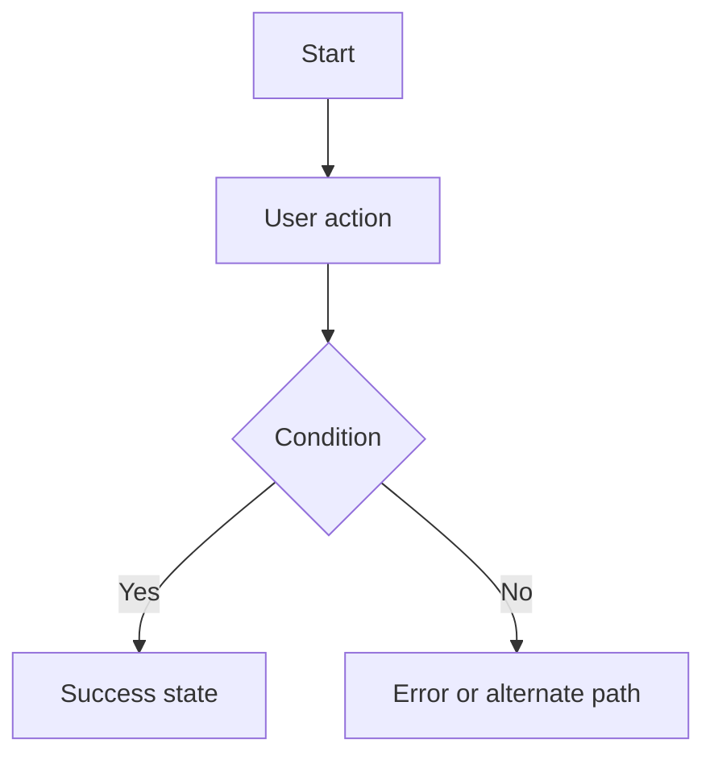

# Functional specification template

```markdown
# Functional Specification: [Feature name]

## 1. Summary

[Explain the feature in 3-5 sentences. Include the user problem, the product outcome, and the affected surface.]

## 2. Goals and Non-goals

### Goals

- [Goal 1]
- [Goal 2]

### Non-goals

- [Explicitly excluded behavior]

## 3. Users and Use Cases

| User / Actor | Need | Scenario |
| --- | --- | --- |
| [Persona] | [Need] | [Example scenario] |

## 4. Scope

### In scope

- [Behavior included]

### Out of scope

- [Behavior excluded]

## 5. User Journey

[Describe the happy path in ordered steps.]



## 6. Functional Requirements

| ID | Requirement | Priority | Acceptance criteria |
| --- | --- | --- | --- |
| FR-001 | [Testable behavior] | Must | Given [context], when [action], then [outcome]. |

## 7. States and Edge Cases

| State / Case | Expected behavior | User feedback |
| --- | --- | --- |
| Empty state | [Behavior] | [Copy or message] |
| Error state | [Behavior] | [Copy or message] |

## 8. Permissions and Access Rules

| Actor / Role | Can do | Cannot do | Notes |
| --- | --- | --- | --- |
| [Role] | [Allowed] | [Denied] | [Notes] |

## 9. Data and Content Requirements

| Field / Content | Source | Validation | Notes |
| --- | --- | --- | --- |
| [Field] | [Source] | [Rule] | [Notes] |

## 10. Analytics and Tracking

| Event | Trigger | Properties | Purpose |
| --- | --- | --- | --- |
| [event_name] | [When it fires] | [properties] | [Decision it supports] |

## 11. Dependencies

- [Design, API, legal, data, platform, release dependency]

## 12. Rollout and Migration

- [Feature flag, migration, beta, phased rollout, communication]

## 13. QA Scenarios

- Given [context], when [action], then [expected result].

## 14. Open Questions

- [Question] - owner: [name/team] - needed by: [date/milestone]
```
