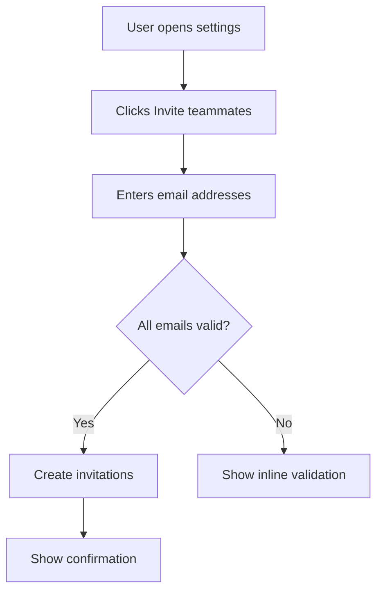
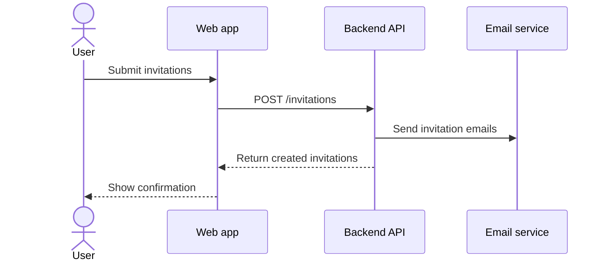
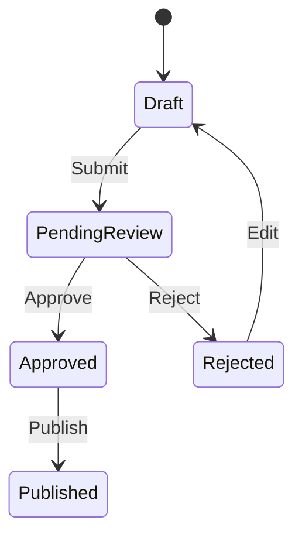
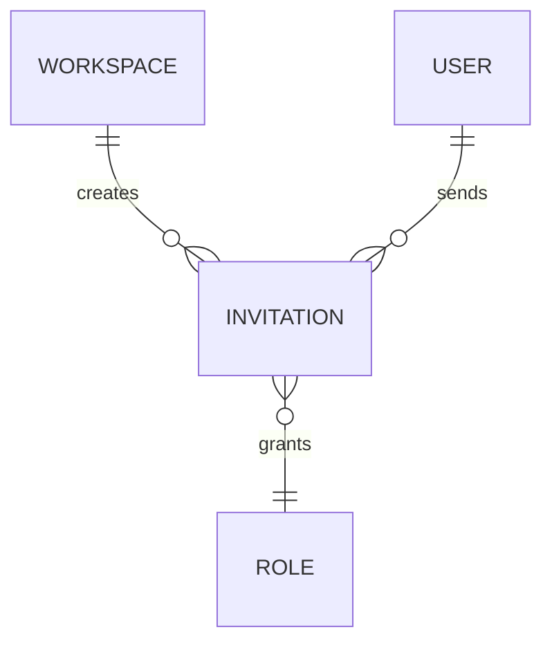

# Mermaid patterns for functional specs

## User flow

## Sequence diagram

## State diagram

## Entity relationship

## Diagram rules

- Keep labels short and business-readable.
- Avoid more than 12 nodes unless the user asks for a detailed process map.
- Add one sentence before the diagram explaining the key takeaway.
